# Trato Inventory Management

## Description
Trato is a basic version of an Inventory Management System built using Flutter and Firebase. The app allows users to manage products, track sales and purchases, and generate reports. It features user authentication, state management using `flutter_bloc`, and the ability to add, edit, and delete products, view inventory status, and generate PDF reports for sales and purchases.

## Features
- **User Authentication**: Firebase Authentication is used for secure login and user management.
- **Add New Product**: Users can add products to the inventory with details like name, quantity, and price.
- **Edit Existing Product**: Update product details, such as price and stock quantity.
- **Delete Product**: Remove a product from the inventory.
- **Inventory Dashboard**: Provides a snapshot of current inventory status, including:
  - Products in stock
  - Total sales
  - Total purchases
- **Stock-Out Alerts**: List products that are out of stock or running low.
- **Sales and Purchase Reports**: View the latest sales and purchase transactions.
- **PDF Report Generation**: Generate a PDF report for individual sales or purchase transactions.
- **View Purchase and Sales Reports**: View a detailed report of past sales and purchases.
- **Real-Time Database**: Product information and transactions are stored and retrieved using Firebase Firestore.
- **State Management**: Managed efficiently with `flutter_bloc` for handling UI states and business logic.
- **Responsive UI**: Optimized to work smoothly on different device sizes and orientations.

## Screenshots
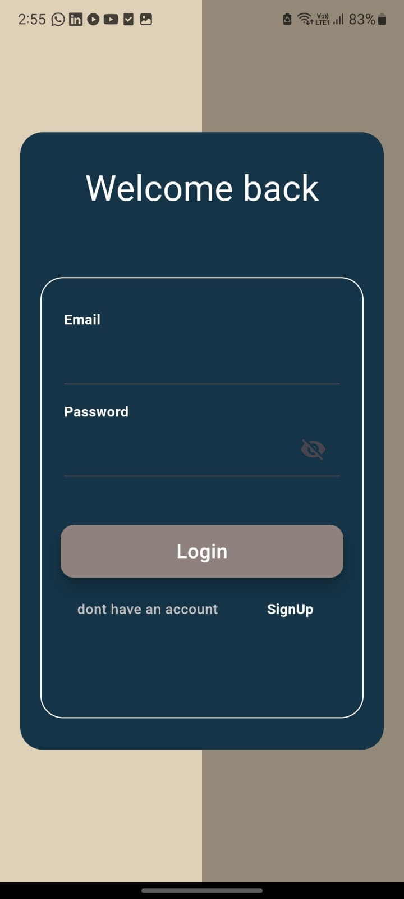
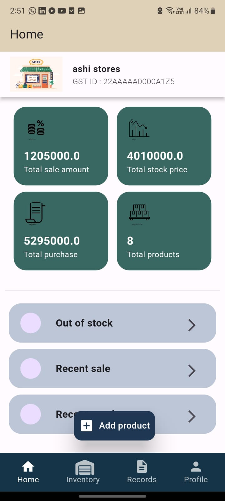
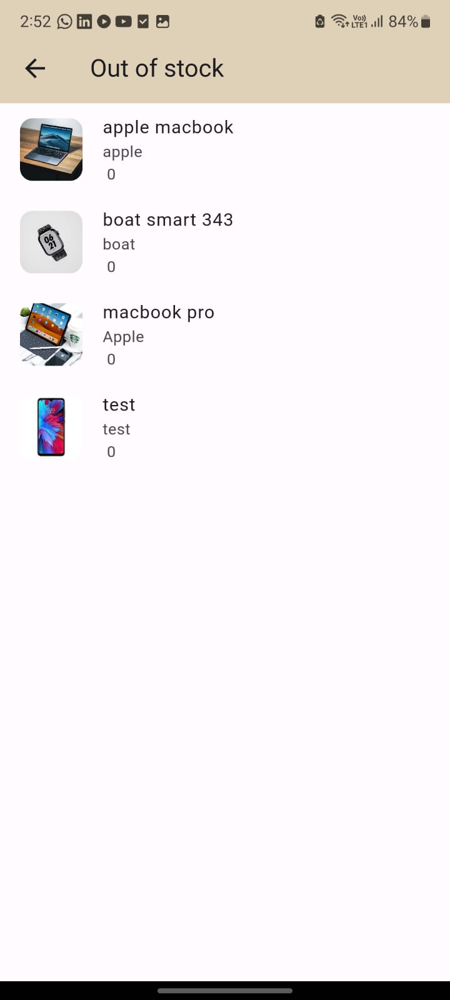
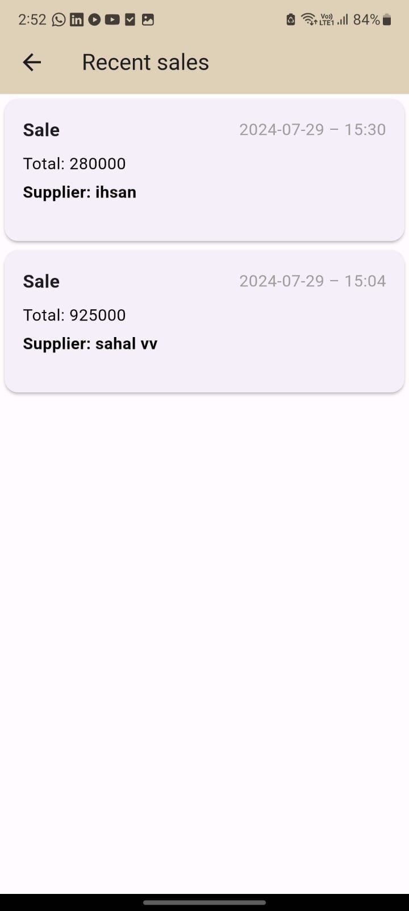

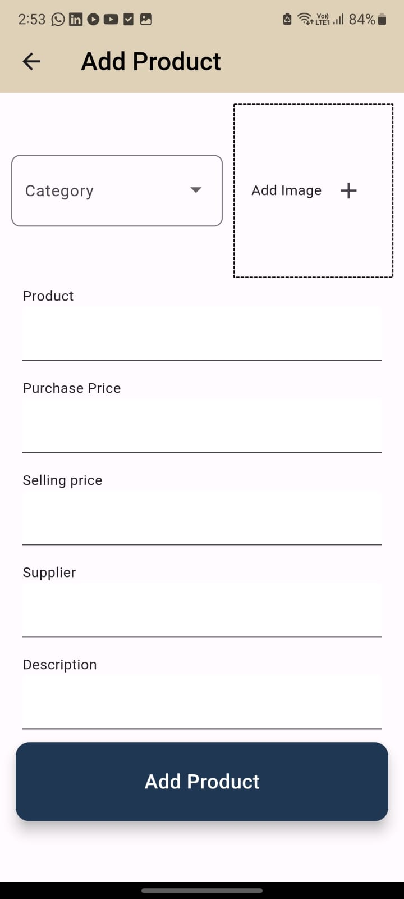

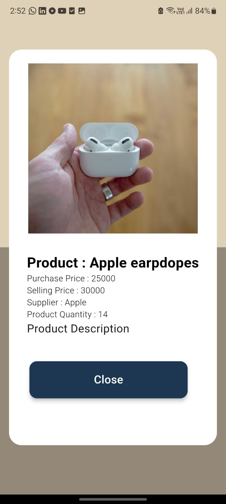
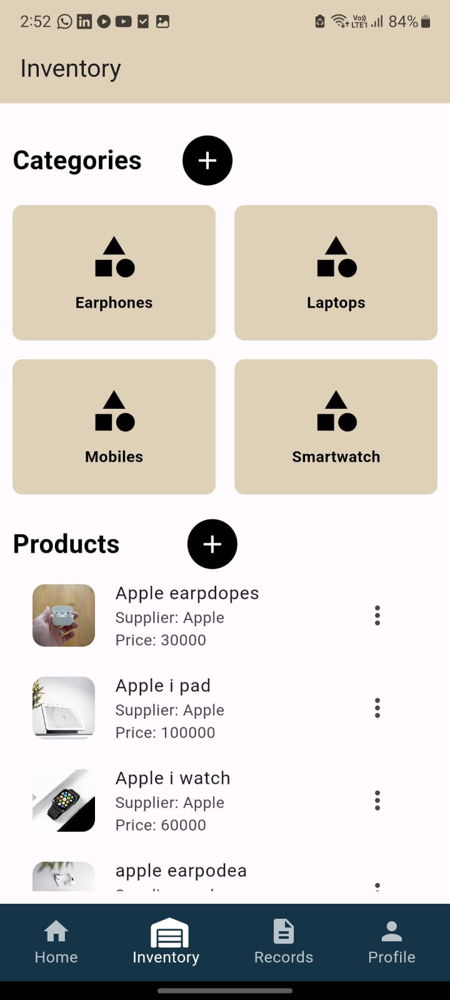
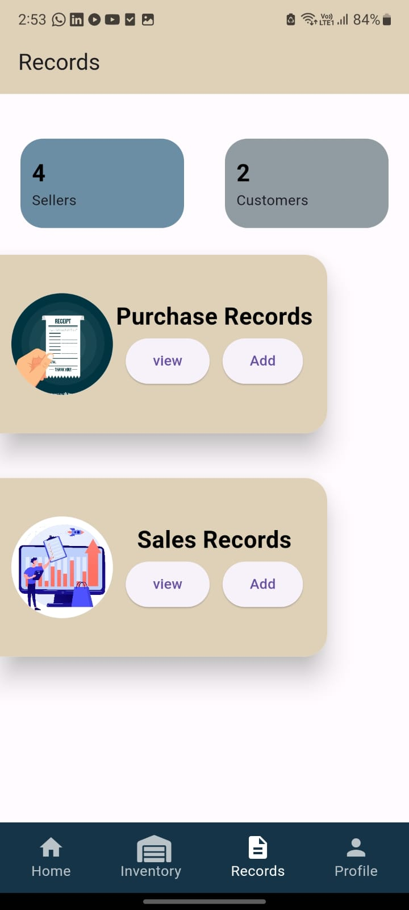
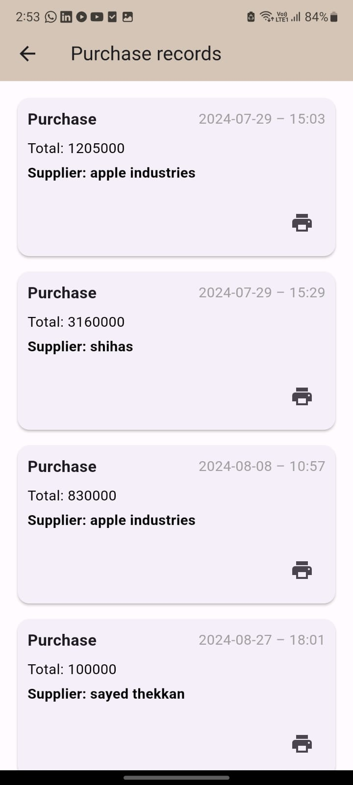
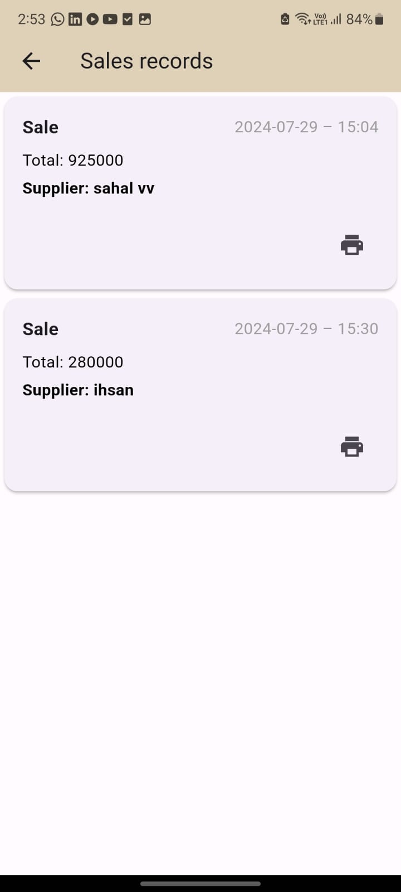
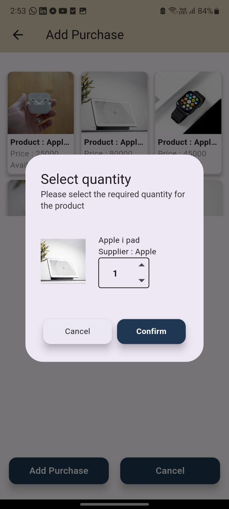

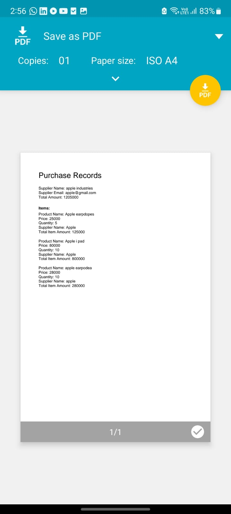

## Getting Started

### Prerequisites
- [Flutter](https://flutter.dev/docs/get-started/install) SDK installed on your machine.
- A code editor such as [VS Code](https://code.visualstudio.com/) or [Android Studio](https://developer.android.com/studio).
- A Firebase account for authentication and real-time database.

### Installation

1. Clone the repository:
    \`\`\`bash
    git clone https://github.com/username/inventory-management-app.git
    \`\`\`

2. Navigate to the project directory:
    \`\`\`bash
    cd inventory-management-app
    \`\`\`

3. Install the dependencies:
    \`\`\`bash
    flutter pub get
    \`\`\`

4. Set up Firebase:
   - Follow the [Firebase setup guide](https://firebase.flutter.dev/docs/overview) to configure Firebase for the app.
   - Add the \`google-services.json\` file (for Android) or \`GoogleService-Info.plist\` (for iOS) to the appropriate project directories.

5. Run the app:
    \`\`\`bash
    flutter run
    \`\`\`

### Folder Structure

\`\`\`bash
lib/
├── features/               # Contains presentation and buisiness logic
├── models/                 # Data models (Product, Sale, Purchase)
├── utils/                  # utilily methods and classes
├── widgets/                # Reusable UI components (ProductCard, ReportList)
├── firebase_options.dart   # firebase options
└── main.dart               # Entry point of the application
\`\`\`

## Key Packages

- **firebase_core**: Core Firebase functionalities.
- **firebase_auth**: For user authentication and login functionalities.
- **cloud_firestore**: Firestore is used as the main database to store and manage inventory data.
- **firebase_storage**: Used to store and retrieve images (e.g., product photos).
- **flutter_bloc**: State management across the app using the BLoC pattern.
- **flutter_svg**: For rendering SVG images in the UI.
- **google_fonts**: Custom fonts to improve the UI and user experience.
- **pdf**: To generate PDF reports for sales and purchases.
- **flutter_pdfview**: Allows users to view generated PDFs directly in the app.
- **connectivity_plus**: For checking the network status, especially before making Firebase requests.
- **shared_preferences**: Used for saving user preferences locally.
- **image_picker**: Enables users to pick images from their device, such as product photos.

## Future Enhancements
- **Multi-User Roles**: Implement user roles for different access levels (e.g., admin, seller).
- **Offline Mode**: Add support for offline data storage and syncing with Firebase once the network is available.
- **Advanced Reporting**: Provide more detailed reports with filtering options and visualizations.